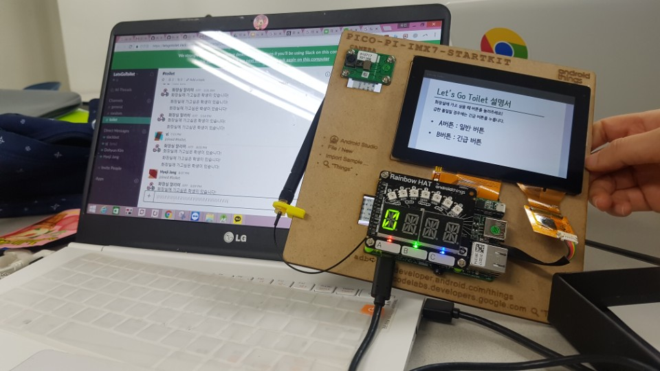

# Let's Go Toilet🚽
<p align=center>

</p>

> team logo

## introduction

Let's Go Toilet은 화장실에 가고 싶을 때 버튼 하나만 눌러서 멘토님께 알림을 보낼 수 있는 Android Things 어플리케이션 입니다.

## Hardware components
- [Pico Pro Maker Kit 1개](https://developer.android.com/things/hardware/imx7d-kit.html#unbox)

## Software apps and online services
- [[Slack Incoming Webhook](https://api.slack.com/incoming-webhooks)](https://youtu.be/i0Yba_Emlz4)

## How to use
1. 해당 어플리케이션 zip 파일을 다운로드하거나 clone을 합니다.
2. 자신의 kit를 네트워크에 연결합니다.
3. 알림을 받기 원하는 채널에 들어가서 [channel settings]-[Add an app] 탭을 눌러 incoming Webhook을 추가해줍니다.
4. 해당하는 Webhook의 url을 복사한 후, 어플리케이션의 MainActivity.java 중 msgThread의 toilet.post()에 주소를 붙여넣습니다.
```java
class msgThread extends Thread {
    ...
    public void sendToiletMsg() {
       ...
        try {
            response = toilet.post("자신의 Webhook URL 기입", json);
        } catch (IOException e) {
            e.printStackTrace();
        }
    }
}
```
4. 안드로이드 스투디오에서 어플리케이션을 열고 메뉴의 [Run]-[Run 'apps']를 눌러 어플리케이션을 실행합니다.
5. 화장실에 가고 싶을 때 Kit의 A버튼을, 급한 볼일에는 B버튼을 눌러주세요!
- A버튼(일반 버튼)의 경우 5명이 모였을 때 불빛과 소리, 그리고 슬랙 메세지 알림이 갑니다.
- B버튼(긴급 버튼)의 경우 바로 불빛과 소리, 그리고 슬랙 메세지 알림이 갑니다.

## License
[](https://opensource.org/licenses/Apache-2.0)
